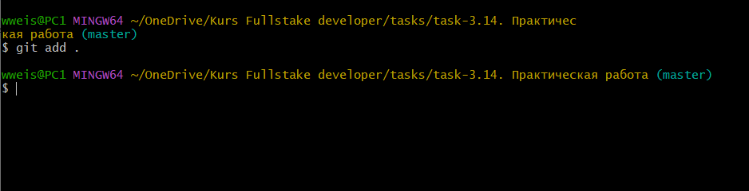

[Главная](readme.md)

---
## <p align='center'>git add</p>


<br>

Теперь мы можем добавить наши файлы в коммит.

Добавление **одного** файла в коммит.

```bash=
git add[имя_файла]
```
<br>

Добавление **всех** файлов в коммит.

```bash=
git add .
```
<br>

Команда позволит обновить отслеживаемые файлы.

```bash=
git add —update
```
<br>

А эта команда добавит даже **игнорируемые** файлы.

```bash=
git add —force 
```
<br>

Bведём в командной строке, Git Bash или Терминале VS-Code команду **git add .** и добавим все файлы в коммит.

<p align='center'></p>

Отлично! файлы добавлены.

---
[ < назад](status.md) &nbsp;&nbsp;&nbsp;&nbsp; [вперёд >](commit.md)