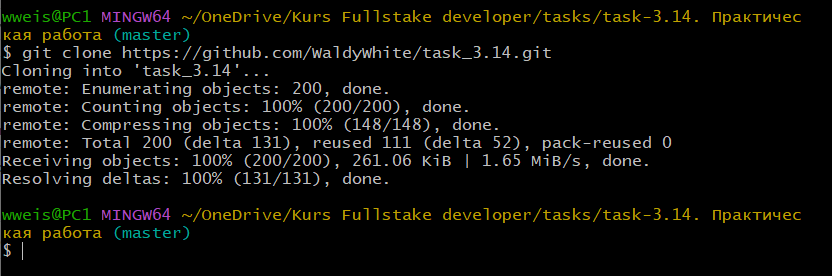

## git clone
---
<br>

Эта команда создадёт рабочую копию.
```bash=
git clone[url]
```
- >_Где **[ url ]** — это путь до клонируемого репозитория_.

<br>

Давайте выполним команду git clone и посмотрим что произойдёт.



Отлично! теперь репозиторий склонирован.

<br>

Иногда нужно склонировать только конкретную ветку, тогда нужно выполнить следующую команду.
```bash=
git clone --branch=branch-name http://whatever.git
```
---