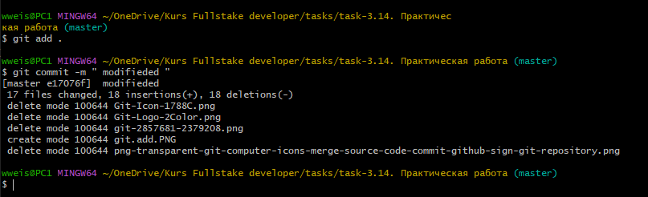

## <p style='text-align:center'>git commit</p>
---
<br>

**git commit -m *"Commit message"*** - Создание коммита.

<br>

Создадим коммит командой:

```bash=
git commit -m "Commit message"
```
<br>


- Файл(-ы) находятся в *HEAD* вашей рабочей локальной копии. В вашем удаленном репозитории их все еще нет.

<br>

>Вы редактировали несколько файлов и хотите *закоммитить* все изменения так что бы **file_1.md** и **file_2.md** были одним коммитом, a **file_3.md** и **file_4.md** должны идти отдельным *коммитом* так как они логически не связаны с первыми двумя.
```bash=
git add file_1.md
git add file_2.md
git commit -m "Commit message for file_1.md and file_2.md"
```
```bash=
git add file_3.md
git add file_4.md
git commit -m "Commit message for file_3.md and file_4.md"
```
---