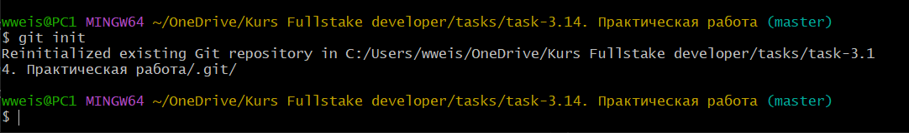

## <p style='text-align:center'>git init</p>
---
<br>

>Создаёт локальный репозиторий:
```brash=
git init
```
- Локальный репозиторий в этой папке создан. То, что здесь сейчас хранится, будет бекапом.

>В данном примере ***повторно*** инициализирован существующий репозиторий.



---
