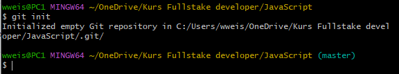

[Главная](readme.md) 

---
## <p align='center'>git init</p>


<br>

Теперь давайте создадим локальный репозиторий с помощью команды **git init**
```brash=
git init
```
<br>



- >_Отлично ! Локальный репозиторий в этой папке создан. То, что здесь сейчас хранится, будет бекапом_.

<br>
<br>


- >_В данном примере ***повторно*** инициализирован существующий репозиторий,что собственно и указано в сообщении_.

---
[ < назад](config.md) &nbsp;&nbsp;&nbsp;&nbsp; [вперёд >](clone.md)
