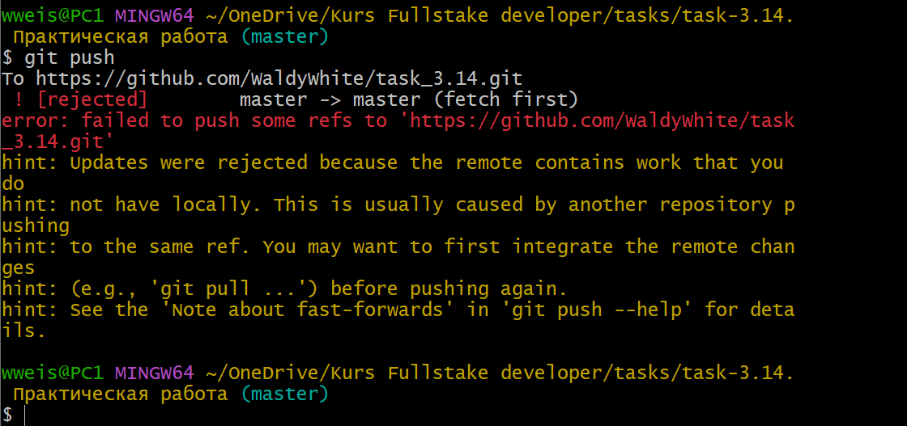
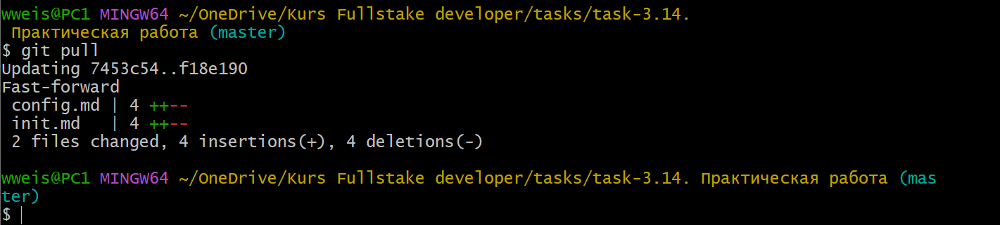

## git pull
---
<br>

Чтобы обновить локальный репозиторий до последнего коммита, нужно сделать *“пулл”*.

```bash=
git pull [ветка]
```
>- git pull [ветка] - например origin master

<br>

 Пример:

>- _После выполнения команды **git push** в консоле мы видим ошибку, указывающую на то что в удалённом репозитории произошли изменения_.



<br>

>- _Что-бы это исправить применим команду **git pull**_.



>- Отлично теперь все изменения добавлены в локальный репозиторий и мы опять смело можем добавить наши изменения на GitHub.

```bash=
git add
git commit -m "massege"
git push
```

---