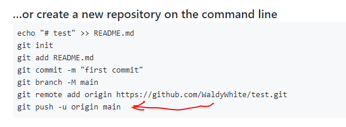
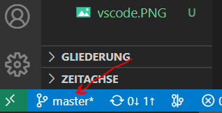
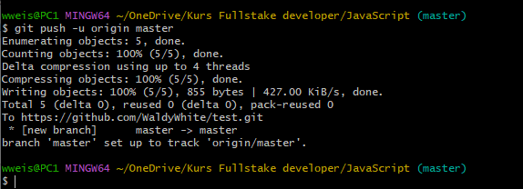

[Главная](readme.md) 

---
## <p align='center'>git push</p>


<br>

Отлично! мы хорошо потрудились, создали наш локальный репозиторий с помощью **[git init](init.md)**, добавили файлы **[git add](add.md)**, командой **[git commit -m](commit.md)** *закоммитили* и указали путь в наш удалённый репозиторий на GitHub задав команду **[git remote](remote.md)** с указанием адресса.

Но наш репозиторий на GitHub по прежнему пуст. Что-же делать?

Для того чтобы залить всё в репозиторий, давайте в командной строке в GitBash или в терминале VS-Code (_кому как удобно_) выполним команду **git push**.



>>>>Обратите внимание на GitHub в конце команды указана ветка ***main***, нам же нужно указать ***master***

>>>>Можно проверить в левом нижнем углу VS-Code
<p align='center'></p>

```bash=
git push -u origin master
```
<br>

Выполним команду



Отлично!

Заходим в наш репозиторий на GitHub , обновляем страницу, Отлично! всё добавлено!

В дальнейшем при работе с вашим репозиторием вы можете задавать просто **git push** вместо ( ***git push -u origin master*** )

---
[ < назад](remote.md) &nbsp;&nbsp;&nbsp;&nbsp; [вперёд >](pull.md)