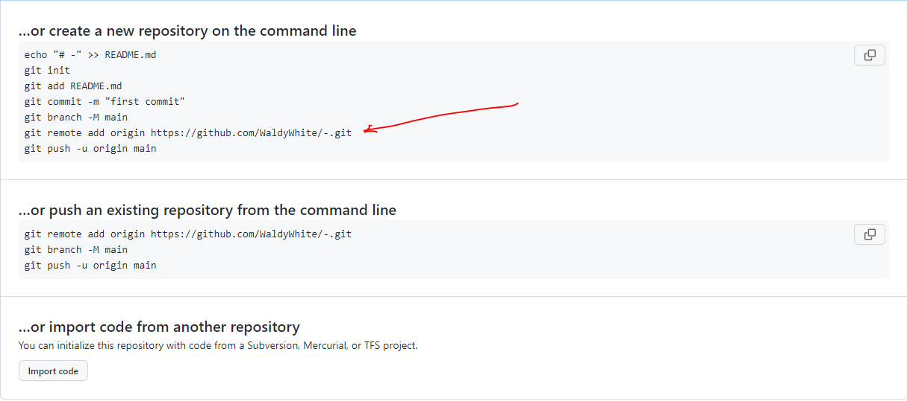
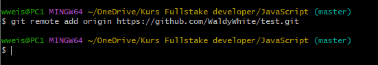

## git remote
---
[Главная](readme.md) 

---
<br>

Прежде чем добавлять что либо в удаленный репозиторий, нам нужно его создать на GitHub.

После чего мы увидим окно, с командами необходимыми для работы с репозиторием в командной строке,
где мы так же можем найти команду **git remote add origin** с указанием полного пути к нашему репозиторию.



```bash=
git remote add origin [сервер]
```
- >Где ***[ сервер ]*** — это путь до репозитория.
<br>

Теперь полностью копируем команду git remote с адресом  репозитория и вставляем в GitBash.
```bash=
git remote add origin https://github.com/someone/something.git
```


Отлично! теперь путь в наш репозиторий указан и можно переходить к седующей команде.
 
---
[ < назад](commit.md) &nbsp;&nbsp;&nbsp;&nbsp; [вперёд >](push.md)
