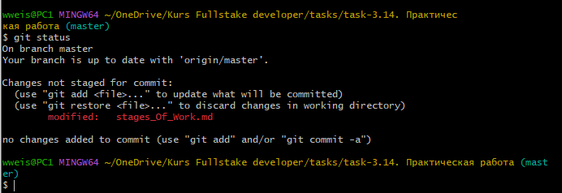

## git status
---
<br>

Чтобы узнать статус репозитория нам понадобится команда **git status** давайте зададим её в Git Bash.
```bash=¨
git status
```
<br>

- >_В данном примере мы видим сообщение ( **modified : stages_Of_Work.md** ) указывающее на то что в файл **stages_Of_Work.md** были внесены изменения_.



---
